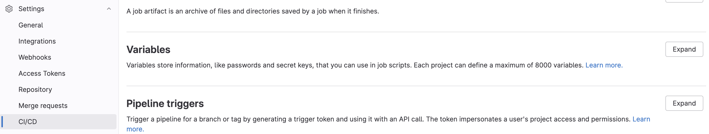
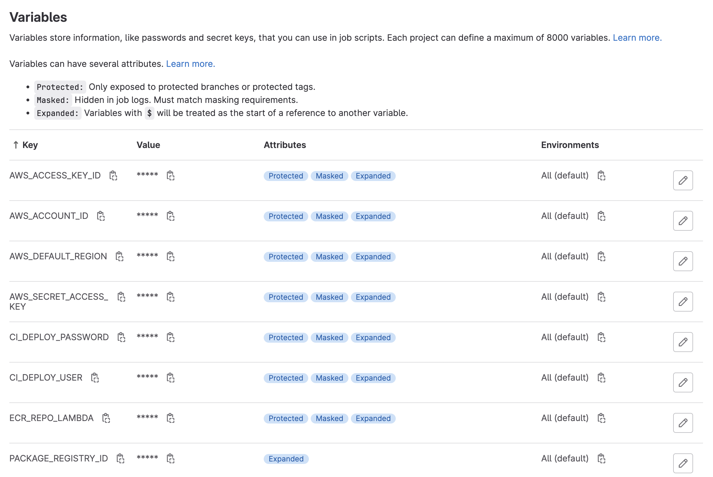

This is the last post in a mini-series on [designing Gitlab CI/CD pipelines](  ).  We've discussed the basic anatomy of a `.gitlab-ci.yml` file, how to set up authentication tokens and files for building and pushing packages to a registry, and designing a Dockerfile for building images from a package in the context of a CI/CD pipeline.  In this post, I'm going to show how to push your package to a remote AWS Elastic Container Registry (ECR).

The structure of this CI/CD job will be analogous to the CI/CD job defined at the end of our first [post](  ), where we pushed an image to the Gitlab Container Registry.

#### Setting up AWS variables

To build images, tag them, and push them to the remote AWS ECR, I used the definition of a CI/CD job below.  In addition to pre-defined variables that are set internally by Gitlab, we can also manually pre-define variables.  In this case, I've set a few that allow me to interact with AWS via the command line:
 * `AWS_DEFAULT_REGION`: self-explanatory
 * `ECR_REPO_LAMBDA`: `${AWS_ACCOUNT_ID}`.dkr.ecr.`${AWS_DEFAULT_REGION}`.amazonaws.com/`${YOUR_ECR_REPO_NAME}`
 * `AWS_ACCOUNT_ID`: AWS account ID
 * `AWS_ACCESS_KEY`: this is the information contained in the downloaded *.pem file
 * `AWS_SECRET_ACCESS_KEY`: this is the information contained in the downloaded *.pem file

To set variables that are accessible by CI/CD jobs, go to your **Project/Group > Settings > CI/CD > Variables > Expand** and define the variables of interest:




If you define these variables at the Gitlab Group level, they will be propagated down to the project level, so long as the Project falls under the Group scope.

#### Pushing to AWS ECR via CI/CD job

Below, we define the actual CI/CD job.   There were two aspects here that I needed to solve.  First, I needed access to a Docker-in-Docker build image e.g. an image that had Docker installed.  And second, this image also needed to have the AWS CLI tool installed.  To that end, I used the `bentolor/docker-dind-awscli` [image](https://github.com/bentolor/docker-dind-awscli).

```yaml
build-image-ecr:
  stage: deploy 
  image: bentolor/docker-dind-awscli
  services:
    - docker:dind
  variables:
    # convenience variable indicating name of the image with respect to the ECR repo and unique tag ID
    IMAGE_TAG: $ECR_REPO_LAMBDA:$CI_COMMIT_SHORT_SHA

  before_script:
    - docker info
    # authenticate docker with your AWS ECR account
    - aws ecr get-login-password --region $AWS_DEFAULT_REGION | docker login --username AWS --password-stdin $AWS_ACCOUNT_ID.dkr.ecr.$AWS_DEFAULT_REGION.amazonaws.com
  # will push Docker image to AWS ECR
  script:
    # build the docker imagae
    - docker build --compress -t ${IMAGE_TAG} .
    # tag the image with a unique name
    - docker tag ${IMAGE_TAG} $ECR_REPO_LAMBDA:latest
    # push the image to the ECR
    - docker push ${IMAGE_TAG}

  # here, we only build and push the image if this is a merge event into the "main" branch
  rules:
    - if: $CI_PIPELINE_SOURCE == 'merge_request_event' && $CI_MERGE_REQUEST_TARGET_BRANCH_NAME == "main"
```

And voila!  You have now pushed your built image to a remote container registry!